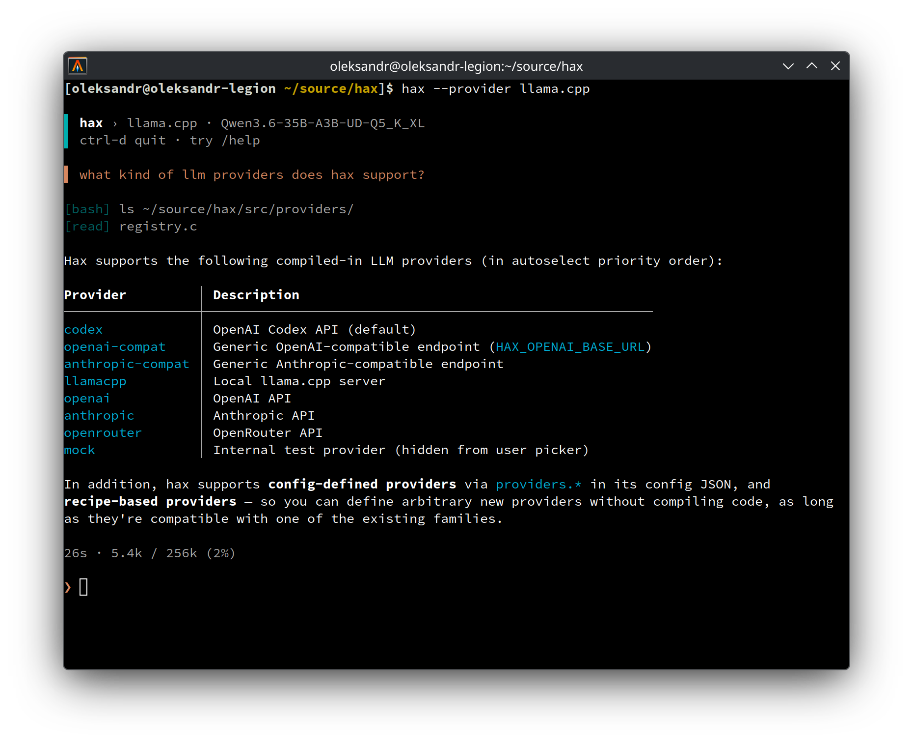

<div align="center">

# hax

**A minimalist, terminal-native coding agent written in C.**



</div>

## Key features

- **Lightweight by design** — a single native C binary with a small dependency set.
  Uses very small amount of memory (just a few MBs) - so more RAM is left for your local LLMs.
- **High quality presentation** — streaming Markdown formatting, and streaming output of
  bash tool invocations, reflowed and/or truncated for display in the terminal. Only redraws
  the current streaming line or the input area, native terminal scrollback is preserved.
- **Inspectable** — See exactly what was sent to the model and what it replied in a usable
  transcript view (Ctrl+T). Optionally collect a detailed wire protocol trace.
- **Use any provider/model** — Supports OpenAI (+compatible), Anthropic (+compatible),
  Codex (via ChatGPT subscription), OpenRouter, llama.cpp, etc.
- **Automation-friendly** — interactive REPL and `-p` one-shot mode, with clean stdout for
  scripts/agents and resume hints on stderr.

## Build

Requires a C compiler, `libcurl`, `jansson`, `meson`, `ninja`, and `pkg-config`.

```sh
# Debian/Ubuntu
sudo apt install build-essential libcurl4-openssl-dev libjansson-dev meson ninja-build pkg-config

# Arch Linux
sudo pacman -S --needed gcc curl jansson meson ninja pkgconf diffutils
# diffutils is a runtime dependency (hax shells out to diff for edit/write output)

# macOS (Homebrew)
brew install jansson meson ninja pkg-config
# libcurl ships with macOS

meson setup build
meson compile -C build
# The binary is now available at ./build/hax
```

The examples below use `hax` as if it is on `PATH`; after a source build, use `./build/hax`
or install it with `meson install -C build`.

## Quick start

```sh
hax                         # interactive REPL
hax -p "list TODOs"         # run one prompt and print the final answer
printf "explain x" | hax -p # read the prompt from stdin
hax -c                      # continue the latest session for this directory
hax --resume                # pick a past session for this directory
hax --resume=ID -p "next"   # resume a specific session in one-shot mode
```

Run `hax --help` for CLI usage. In the REPL, type `/help` for slash commands and shortcuts.
See [docs/usage.md](./docs/usage.md) for more detailed usage documentation.

## Providers

Select a provider with `HAX_PROVIDER` env var, `~/.config/hax/config.json`, or the interactive
`/provider` picker.

| Provider | Typical setup |
| --- | --- |
| `codex` | Log in with the official `codex` CLI. |
| `openai` | Set `OPENAI_API_KEY`. |
| `openai-compatible` | Set `HAX_OPENAI_BASE_URL`. |
| `anthropic` | Set `ANTHROPIC_API_KEY`. |
| `anthropic-compatible` | Set `HAX_ANTHROPIC_BASE_URL`. |
| `openrouter` | Set `OPENROUTER_API_KEY`. |
| `llama.cpp` | Run `llama-server`. |
| `ollama` | Run `ollama serve`. |

See [docs/providers.md](./docs/providers.md) for provider-specific behavior and custom providers.

## Configuration

Every registered setting has a canonical config key and, when applicable, an `HAX_*`
environment variable. Runtime selections made with `/provider`, `/model`, and `/effort` are
stored separately from your config file.

Resolution order is:

```text
runtime selection → environment → state.json → config.json → default
```

See [docs/configuration.md](./docs/configuration.md) for the file format and setting reference.

## More docs

- [docs/debugging.md](./docs/debugging.md) — trace/transcript logs, mock provider, and demo scripts.

## License

MIT.
