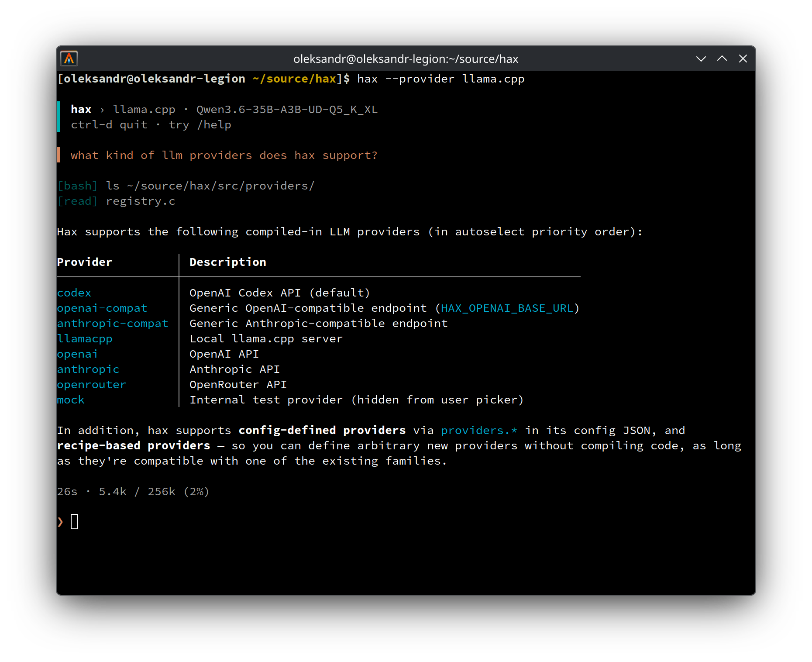

<div align="center">

# hax

**A minimalist, terminal-native coding agent written in C.**



</div>

## Key features

- **Lightweight by design** — a single native C binary with a small dependency set.
  Uses very small amount of memory (just a few MBs) - so more RAM is left for your local LLMs.
- **High quality presentation** — streaming Markdown formatting, and streaming output of
  bash tool invocations, reflowed and/or truncated for display in the terminal. Only redraws
  the current streaming line or the input area, native terminal scrollback is preserved.
- **Inspectable** — See exactly what was sent to the model and what it replied in a usable
  transcript view (Ctrl+T). Optionally collect a detailed wire protocol trace.
- **Use any provider/model** — Supports OpenAI (+compatible), Anthropic (+compatible),
  Codex (via ChatGPT subscription), OpenRouter, llama.cpp, etc.
- **Automation-friendly** — interactive REPL and `-p` one-shot mode, with clean stdout for
  scripts/agents and resume hints on stderr.

## Install

hax runs on Linux and macOS; on Windows, use it under
[WSL](https://learn.microsoft.com/en-us/windows/wsl/).

With [Homebrew](https://brew.sh) (macOS or Linux):

```sh
brew install oleksandrchekhovskyi/hax/hax
```

On Linux, download the prebuilt static binary for your architecture (x86_64 or aarch64) from the
[latest release](https://github.com/OleksandrChekhovskyi/hax/releases/latest), then unpack the
`hax` binary into any directory on your `PATH`.

### From source

Building from source gives a binary linked against your system's shared libraries instead of
a static one:

```sh
git clone https://github.com/OleksandrChekhovskyi/hax.git
cd hax
scripts/install_deps.sh   # Debian/Ubuntu, Fedora, Arch, openSUSE, Alpine, macOS
make                      # the binary is now at ./build/hax
make install              # optional; may prompt for sudo
```

`scripts/install_deps.sh` installs the build dependencies — a C compiler, `libcurl`,
`jansson`, `meson`, `ninja`, and `pkg-config` — plus `fzf`, which hax uses for `@file`
completion when available. On other platforms, install those packages by hand and run `make`.

For hacking on hax, `make symlink` links the freshly built binary into `~/.local/bin` so it
stays on `PATH` across rebuilds. `make lint` additionally needs `clang-format` and
`clang-tidy` (`scripts/install_deps.sh lint` installs them).

The examples below use `hax` as if it is on `PATH`; after a plain build, use `./build/hax`.

## Connect a provider

The easiest first run is interactive: start `hax`, then use `/provider` to see available providers
and choose a model. hax remembers interactive provider, model, and effort selections.

| Provider | Setup |
| --- | --- |
| `codex` | Log in with the official `codex` CLI. |
| `openai` | Set `OPENAI_API_KEY`. |
| `anthropic` | Set `ANTHROPIC_API_KEY`. |
| `openrouter` | Set `OPENROUTER_API_KEY`. |
| `llama.cpp` | Run `llama-server`. |
| `ollama` | Run `ollama serve`. |
| Compatible or custom endpoint | See [docs/providers.md](./docs/providers.md). |

## Quick start

Run hax from the project directory you want it to work in:

```sh
hax                         # interactive REPL
hax -p "list TODOs"         # run one prompt and print the final answer
printf "explain x" | hax -p # read the prompt from stdin
hax -c                      # continue the latest session for this directory
hax --resume                # pick a past session for this directory
hax --resume=ID -p "next"   # resume a specific session in one-shot mode
```

Run `hax --help` for CLI usage. In the REPL, type `/help` for slash commands and shortcuts.
See [docs/usage.md](./docs/usage.md) for more detailed usage documentation.

## Configuration

Every registered setting has a canonical config key and, when applicable, an `HAX_*`
environment variable. Runtime selections made with `/provider`, `/model`, and `/effort` are
stored separately from your config file. The more explicit the input, the higher it wins: a
CLI flag beats an environment variable, which beats anything saved.

See [docs/configuration.md](./docs/configuration.md) for the file format, the full resolution
order, and the setting reference.

## More docs

- [docs/philosophy.md](./docs/philosophy.md) — design approach, and why some conventional
  agent features are deliberately absent.
- [docs/debugging.md](./docs/debugging.md) — trace/transcript logs, mock provider, and demo scripts.

## License

MIT.
